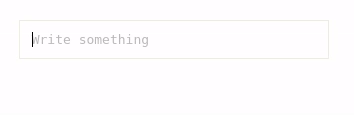

# tagsarea

> A textarea-resembling interface to write posts in form of separated tags



[](https://www.npmjs.com/package/tagsarea) [](https://standardjs.com)

## Install

```bash
npm install --save tagsarea
```

or

```bash
yarn install tagsarea
```

## Usage

```jsx
import React, { Component } from 'react'

import TagsArea from 'tagsarea'

export default class App extends Component {
  render () {
    return <TagsArea onSubmit={(tags) => console.log(tags)} />
  }
}
```

## License

MIT © [optimista](https://github.com/optimista)
